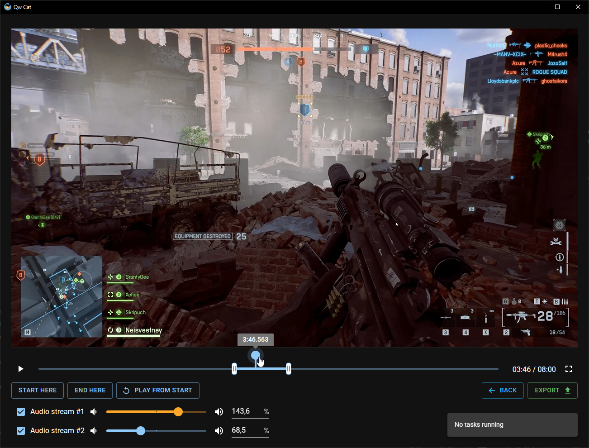

# Qw Cat

**Qw Cat** is a desktop application designed for quick video trimming and processing.  
Built with Tauri v2 and React, powered by FFmpeg.

## Features

- Mixing multiple audio tracks into one with different volume
- Running FFmpeg with nvidia hardware acceleration and using gpu encoders
- Automatic ffmpeg download
- Easy-to-use interface with advanced ffmpeg command customization options

**Note:** Currently only NVIDIA GPU hardware acceleration is supported. AMD and Intel GPU support is not yet
implemented.

## Installation

- Download the latest release from the [releases page](https://github.com/Neisvestney/qw-cat/releases).
- Run the installer and follow the instructions.
- Launch the application.

**Note:** The application has not been tested on macOS yet.

## Development

- Follow the [Tauri documentation](https://v2.tauri.app/start/prerequisites/) to setup development environment.
- Install dependencies with `yarn install`
- Run the app with `yarn tauri dev`

## Building

- Run `yarn tauri build`

## Contributing

Pull requests are welcome.  
Plesae format your code with `cargo fmt` and `cargo clippy` before submitting a PR