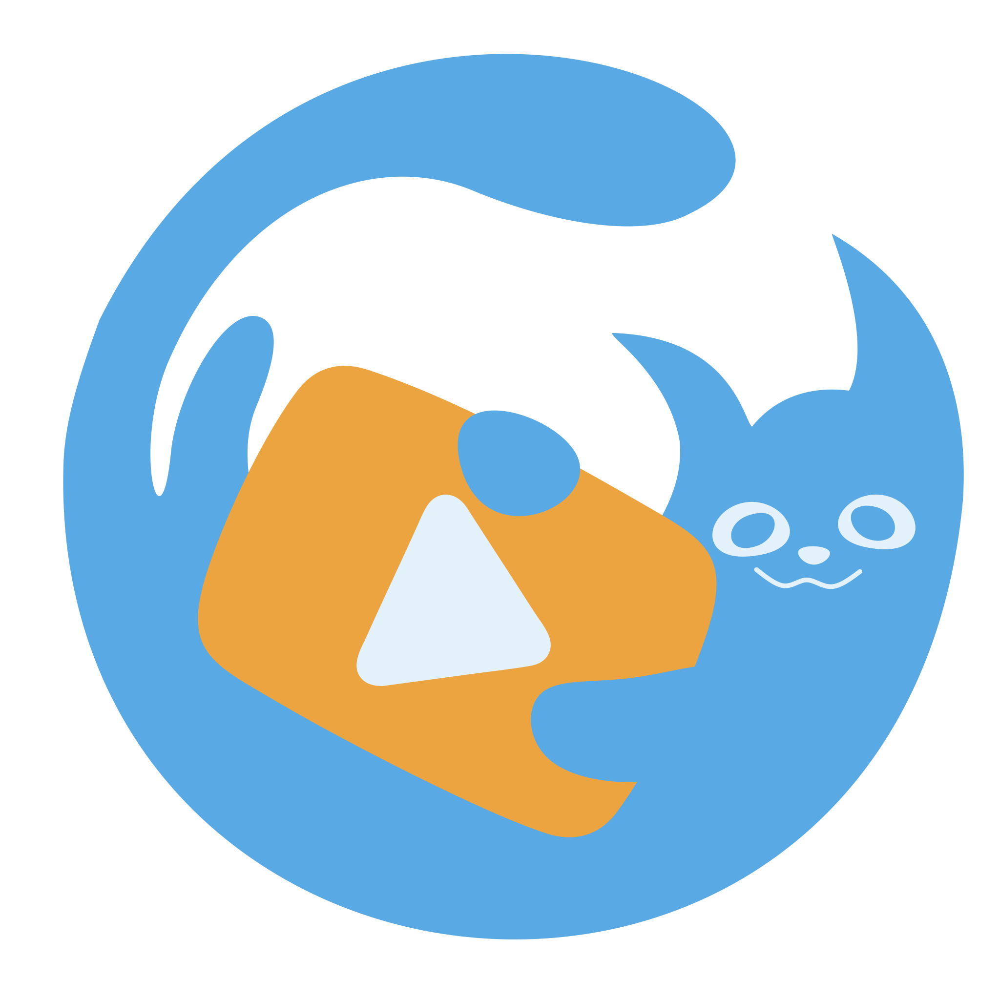
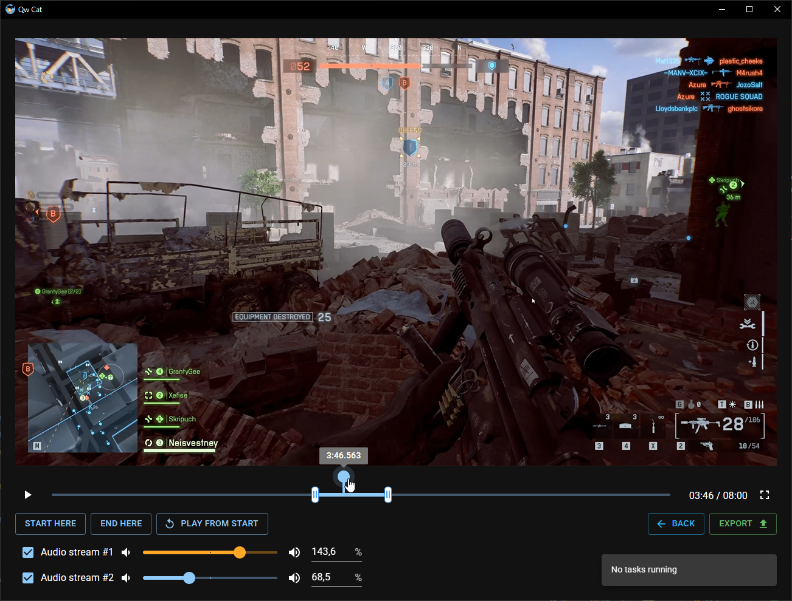

<p align="center">
    
    <h1 align="center"><b>Qw Cat</b></h1>
    <p  align="center">
        Desktop application designed for quick video trimming and processing.
    </p>
    <p align="center">
        <a href="https://github.com/Neisvestney/qw-cat/releases/latest"></a>
        <a href="https://github.com/Neisvestney/qw-cat/releases/latest"></a>
        <a href="https://github.com/Neisvestney/qw-cat/releases/latest"></a>
        <a href="https://github.com/Neisvestney/qw-cat/releases/latest"></a>
    </p>
</p>
<br/>

## Overview

[](https://github.com/Neisvestney/qw-cat/releases/latest)



Built with Tauri v2 and React, powered by FFmpeg.

## Features

- Mixing multiple audio tracks into one with different volume
- Running FFmpeg with NVIDIA, AMD, Intel or Apple hardware acceleration and using gpu encoders
- Automatic ffmpeg download
- Easy-to-use interface with advanced video export options customization

## Installation

- Download the latest release from the [releases page](https://github.com/Neisvestney/qw-cat/releases).
- Run the installer and follow the instructions.
- Launch the application.

You can install FFmpeg before launching the application if you want to use it right away.

For linux you also need to [install](https://gstreamer.freedesktop.org/documentation/installing/on-linux.html?gi-language=c) `gstreamer` with plugins to be able to play videos.  
For KDE Plasma you can install `libunity9` package to display a progress bar in the taskbar.

For macOS the app is not notarized, so Gatekeeper reports it as damaged after download. Move `Qw Cat.app` to
`/Applications` and remove the quarantine attribute:

```sh
xattr -cr "/Applications/Qw Cat.app"
```

## Development

- Follow the [Tauri documentation](https://v2.tauri.app/start/prerequisites/) to setup development environment.
- Install dependencies with `yarn install`
- Run the app with `yarn tauri dev`

## Building

- Run `yarn tauri build`

To generate flatpak manifest run `node ./src-tauri/bundle/render-templates.js local <versionFromCargoToml>_amd64`

## Contributing

Pull requests are welcome.  
Please format your code with `cargo fmt` and `cargo clippy` before submitting a PR
